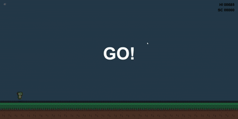
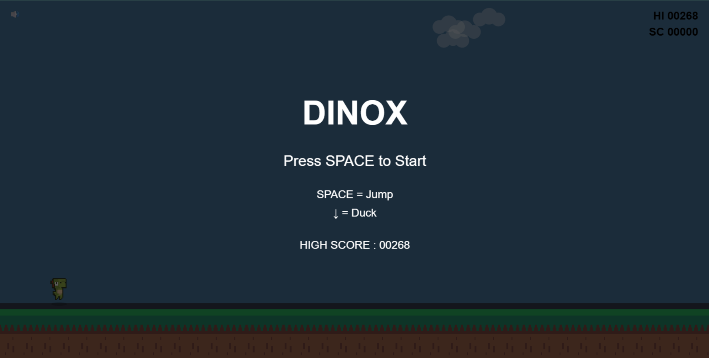
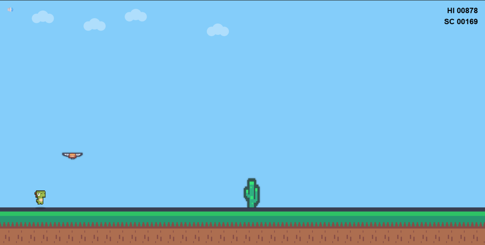
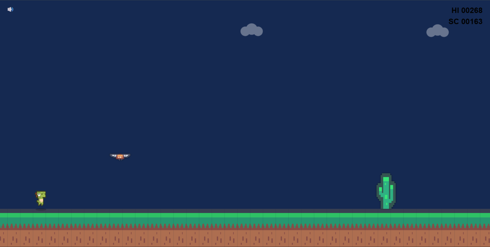
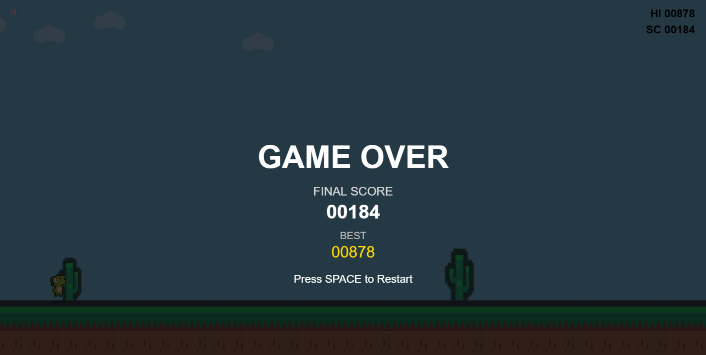

# 🦖 DinoX


> A modern endless runner game inspired by Chrome Dino, built using **JavaScript (ES6 Modules)**, **HTML5 Canvas**, and **Object-Oriented Programming**.

---
## 🎮 Gameplay Video

<p align="center">
  
</p>

---

## 🎮 Play Online

<p align="center">

<a href="https://hardik-321.github.io/DinoX/">


</a>

</p>

---

## 📌 About the Project

DinoX is a desktop-first endless runner game developed from scratch using HTML5 Canvas without any game engine.

The project focuses on clean architecture, modular game development, smooth gameplay mechanics, and professional software engineering practices using Git and sprint-based development.

---

# ✨ Features

- 🦖 Endless Runner Gameplay
- 🌤 Dynamic Day & Night Cycle
- 🌵 Intelligent Obstacle Generation
- 🐦 Three Bird Flight Patterns
- 💨 Landing Dust Particle Effects
- 🔊 Sound Effects
- ⏸ Pause & Resume
- ⏳ 3-2-1 Countdown Before Start
- 🏆 Persistent High Score System
- ⭐ Score Milestones
- 🎨 Smooth Pixel-Art Rendering
- ⚡ Progressive Difficulty System

---

# 🛠 Technologies Used

- JavaScript (ES6 Modules)
- HTML5 Canvas
- CSS3
- Git
- GitHub
- GitHub Pages

---

# 🎮 Controls

| Key | Action |
|-----|--------|
| SPACE | Jump |
| ↓ Arrow | Duck |
| P | Pause |
| M | Mute / Unmute |

---

# 📸 Screenshots

## 🏠 Ready Screen



---

## 🎮 Gameplay



---

## 🌙 Night Mode



---

## 💀 Game Over



---

# 📂 Project Structure

```
DinoX
│
├── assets
│   ├── images
│   ├── sounds
│   └── screenshots
│
├── js
│   ├── core
│   ├── entities
│   ├── managers
│   └── ui
│
├── index.html
├── style.css
├── README.md
└── .gitignore
```

The project follows a modular architecture where each game component has a dedicated responsibility, making the code easier to maintain and extend.

---

# 📈 Development Journey

The project was developed incrementally using a sprint-based workflow.

| Sprint | Major Achievement |
|---------|-------------------|
| Sprint 1 | Game Engine & Player |
| Sprint 2 | Obstacles & Collision |
| Sprint 3 | Score System |
| Sprint 4 | Difficulty Scaling |
| Sprint 5 | Graphics & Animation |
| Sprint 6 | Environment & Clouds |
| Sprint 7 | Gameplay Improvements |
| Sprint 8 | Audio & Polish |
| Sprint 9 | Visual Effects |
| Sprint 10 | Professional UI & Release |

---

# 🚀 Future Roadmap

## Version 1.1

- 📱 Mobile Optimization
- 👆 Touch Controls
- 🔊 Touch-friendly Mute Button
- 📱 Responsive HUD

## Version 1.2

- 🏅 Achievements
- 🎨 Multiple Themes
- ⚙️ Settings Menu

## Version 2.0

- 👾 New Enemy Types
- ⚡ Power-ups
- 🎮 Endless Challenges

---

# 👨‍💻 Author

**Hardik Gupta**

- GitHub: https://github.com/hardik-321

If you enjoyed DinoX, consider ⭐ starring the repository.

---

# 📄 License

This project is licensed under the MIT License.